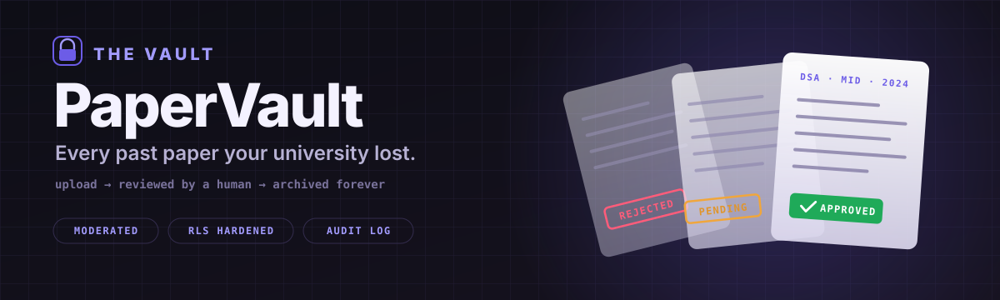
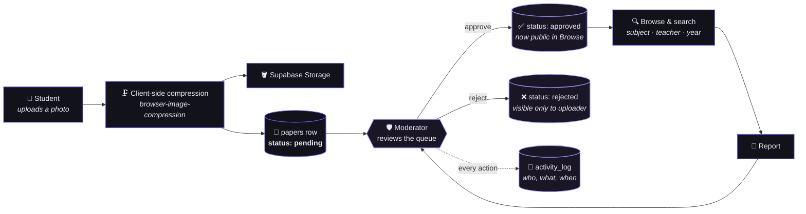
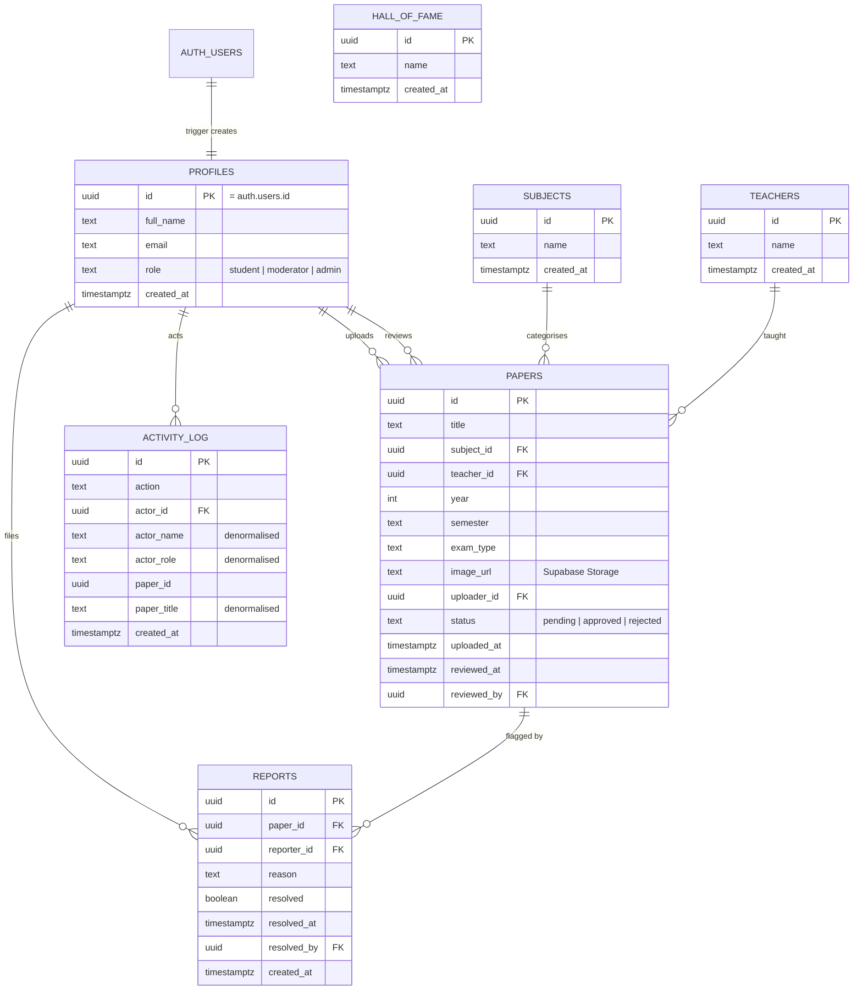
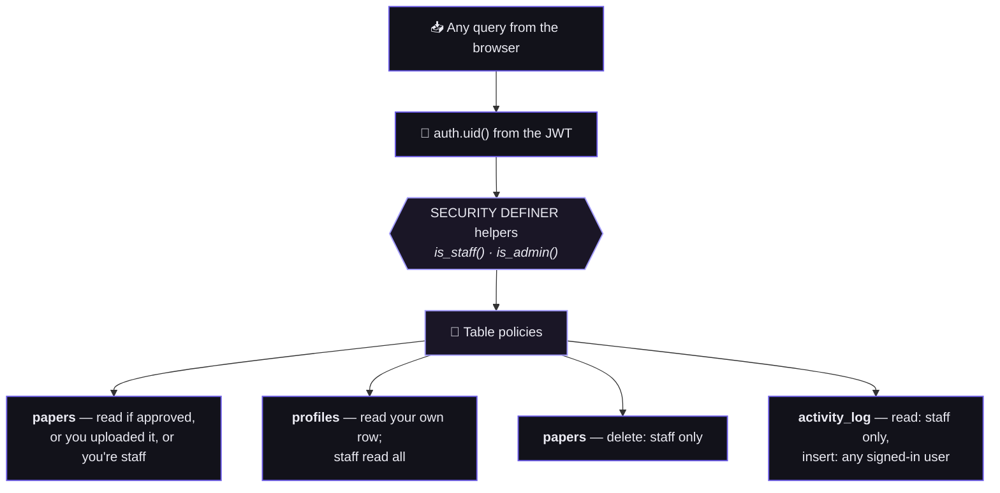

<div align="center">



<br/><br/>

**A moderated archive for exam papers.** Students upload photos, moderators approve them,
and what survives becomes a searchable, permanent vault — instead of a WhatsApp thread
that scrolls into oblivion two weeks before finals.

<br/>

[](https://paper-vault-ivory.vercel.app)


<br/>

</div>

> **The problem.** Past papers exist. They're just scattered across a hundred phone galleries, three dead group chats and one senior who graduated. Nobody knows which ones are real, which year they're from, or who taught that course.
>
> **This.** One vault. Every paper tagged with subject, teacher, year, semester and exam type. Every upload reviewed by a human before anyone else sees it. Every moderation action written to an audit log.

<br/>

---

<!-- ─────────────────────────────────────────────────────────────
     SCREENSHOTS — drop PNGs into screenshots/ and uncomment.

| Home | Browse |
|---|---|
|  |  |

| Paper viewer | Upload |
|---|---|
|  |  |

| Mod dashboard | Admin panel |
|---|---|
|  |  |
────────────────────────────────────────────────────────────── -->

## The idea

An open archive fills up with junk. A closed one never fills up at all. PaperVault sits in
between: **anyone signed in can contribute, nothing goes public until a moderator says so.**



The compression step matters more than it looks: an exam paper photographed on a phone is
3–5 MB. Compressed in the browser *before* upload, it's a few hundred KB — so a student on
campus wifi can contribute in seconds, and the vault stays cheap to host and fast to browse.

<br/>

---

## Who can do what

Four levels of access. Each one is a strict superset of the one above it.

| | **Visitor** | **Student** | **Moderator** | **Admin** |
|---|:---:|:---:|:---:|:---:|
| View approved papers | — | ✅ | ✅ | ✅ |
| Search & filter the vault | — | ✅ | ✅ | ✅ |
| Upload a paper | — | ✅ | ✅ | ✅ |
| See own pending / rejected | — | ✅ | ✅ | ✅ |
| Report a bad paper | — | ✅ | ✅ | ✅ |
| Approve / reject the queue | — | — | ✅ | ✅ |
| Resolve reports | — | — | ✅ | ✅ |
| Read the activity log | — | — | ✅ | ✅ |
| Delete any paper | — | — | ✅ | ✅ |
| Manage users & roles | — | — | — | ✅ |
| Manage subjects & teachers | — | — | — | ✅ |
| Curate the Hall of Fame | — | — | — | ✅ |

> **Note on the visitor column.** The app currently runs behind a **hard auth wall** — an
> unauthenticated visitor is redirected to `/login` before any page renders. The database
> policies still permit public reads of approved papers, so opening the vault to visitors
> is a front-end change only, not a security rewrite.

<br/>

---

## The data model



**Why `activity_log` duplicates names and titles.** An audit trail has to stay readable
after the thing it describes is gone. If a paper is deleted or a user removed, a log row
carrying only foreign keys becomes `null — null — deleted`. Copying `actor_name`,
`actor_role` and `paper_title` at write time means the record still reads *"Ali (moderator)
rejected 'DSA Mid-Term 2024'"* years later. Denormalisation is the point, not an oversight.

Which means the admin panel can always answer *"who let this through?"* —

<table>
<tr><th align="left">When</th><th align="left">Who</th><th align="left">Did what</th><th align="left">To</th></tr>
<tr><td><code>19:42</code></td><td>Hina M. <sub>admin</sub></td><td>🗑️ <b>deleted</b></td><td><i>OS Final 2021 (duplicate)</i></td></tr>
<tr><td><code>19:38</code></td><td>Bilal K. <sub>moderator</sub></td><td>❌ <b>rejected</b></td><td><i>Untitled — blurry, unreadable</i></td></tr>
<tr><td><code>19:31</code></td><td>Bilal K. <sub>moderator</sub></td><td>✅ <b>approved</b></td><td><i>DSA Mid-Term 2024</i></td></tr>
<tr><td><code>19:27</code></td><td>Ahmed R. <sub>student</sub></td><td>⬆️ <b>uploaded</b></td><td><i>DSA Mid-Term 2024</i></td></tr>
<tr><td><code>19:12</code></td><td>Hina M. <sub>admin</sub></td><td>🎖️ <b>promoted</b></td><td><i>Bilal K. → moderator</i></td></tr>
</table>

Still readable after the paper is deleted and the account is gone.

<br/>

---

## Security

Row Level Security is the authorization layer — the front end asks nicely, but **Postgres is
what actually says no**. The hardened policy set lives in
[`supabase_rls_fix.sql`](supabase_rls_fix.sql) and is safe to re-run.



Two details worth calling out:

**1 · The recursion trap.** A policy on `profiles` that checks *"is this user an admin?"*
has to read `profiles` — which fires the policy again, forever. The fix is
`is_staff()` / `is_admin()` declared `security definer` with a pinned `search_path`, so the
role lookup bypasses RLS for that one narrow read and nothing else.

**2 · The self-promotion hole.** Users can edit their own profile, and `role` lives on that
row — so a naive `update using (id = auth.uid())` lets anyone make themselves admin with a
single API call. The `profiles_update_self` policy adds a `with check` requiring `role` to
equal its current value. Only `profiles_update_admin` can change a role.

<details>
<summary><b>Full policy matrix</b></summary>

<br/>

| Table | Read | Insert | Update | Delete |
|---|---|---|---|---|
| `profiles` | own row, or staff | own row only | own row *(role frozen)*, or admin | admin |
| `papers` | approved, or own, or staff | own upload only | staff, or own | staff |
| `subjects` | everyone | admin | admin | admin |
| `teachers` | everyone | admin | admin | admin |
| `activity_log` | staff | any signed-in user | — | — |
| `hall_of_fame` | everyone | admin | admin | admin |
| `storage: papers` | public read | signed-in | — | owner path |

</details>

<br/>

---

## Screens

| Route | Page | What it does |
|---|---|---|
| `/` | **Home** | Stats strip and the twelve most recent approved papers |
| `/browse` | **Browse** | The vault — filter by subject, teacher, year, exam type; paginated |
| `/paper/:id` | **Viewer** | Zoomable full-size view, download, report, moderator actions |
| `/upload` | **Upload** | Compression preview with live before/after size, tagged submission |
| `/profile` | **Profile** | Your uploads and their status, stats, change password |
| `/mod` | **Mod dashboard** | Pending queue and reports queue, side by side |
| `/admin` | **Admin panel** | Users & roles, subjects, teachers, activity log |
| `/hall-of-fame` | **Hall of Fame** | Top contributors — with a sound cue, because why not |
| `/about` | **About** | Who built it |

Every route is **lazily loaded** into its own chunk, so a first-time visitor downloads the
shell and one page — not the admin panel they'll never open.

<br/>

---

## Stack

| Layer | Choice | Note |
|---|---|---|
| Framework | **React 19** + **Vite 8** | Route-level code splitting via `lazy()` |
| Styling | **Plain CSS**, per component | No Tailwind — CSS custom properties drive both themes |
| Motion | **Framer Motion** | `MotionConfig reducedMotion="user"` — respects OS settings |
| Auth | **Supabase Auth** | Email + password, confirmation, reset |
| Database | **Supabase Postgres** | RLS-enforced, not app-enforced |
| Storage | **Supabase Storage** | Public `papers` bucket, owner-scoped deletes |
| Images | **browser-image-compression** | Compress in the browser, before the upload |
| Testing | **Vitest** + **Testing Library** | Route guards, cache and query helpers |
| Hosting | **Vercel** | With `@vercel/analytics` |

<br/>

---

## Run it locally

**1 · Install**

```bash
git clone https://github.com/wasiqtanveer/Paper-Vault.git
cd Paper-Vault
npm install
```

**2 · Configure** — create `.env.local`:

```env
VITE_SUPABASE_URL=https://xxxxxxxx.supabase.co
VITE_SUPABASE_ANON_KEY=eyJhbGciOi...
```

**3 · Create the schema** — in Supabase → **SQL Editor**, run the blocks below in order.

<details>
<summary><b>① Tables</b></summary>

```sql
create table profiles (
  id uuid primary key references auth.users(id) on delete cascade,
  full_name text,
  email text,
  role text default 'student' check (role in ('student','moderator','admin')),
  created_at timestamptz default now()
);

create table subjects (
  id uuid primary key default gen_random_uuid(),
  name text not null,
  created_at timestamptz default now()
);

create table teachers (
  id uuid primary key default gen_random_uuid(),
  name text not null,
  created_at timestamptz default now()
);

create table papers (
  id uuid primary key default gen_random_uuid(),
  title text not null,
  subject_id uuid references subjects(id) on delete set null,
  teacher_id uuid references teachers(id) on delete set null,
  year int not null,
  semester text,
  exam_type text,
  image_url text not null,
  uploader_id uuid references profiles(id) on delete set null,
  status text default 'pending' check (status in ('pending','approved','rejected')),
  uploaded_at timestamptz default now(),
  reviewed_at timestamptz,
  reviewed_by uuid references profiles(id) on delete set null
);

create table reports (
  id uuid primary key default gen_random_uuid(),
  paper_id uuid references papers(id) on delete cascade,
  reporter_id uuid references profiles(id) on delete set null,
  reason text,
  resolved boolean default false,
  resolved_at timestamptz,
  resolved_by uuid references profiles(id) on delete set null,
  created_at timestamptz default now()
);

create table activity_log (
  id uuid primary key default gen_random_uuid(),
  action text not null,
  actor_id uuid references profiles(id) on delete set null,
  actor_name text,
  actor_role text,
  paper_id uuid,
  paper_title text,
  created_at timestamptz default now()
);

create table hall_of_fame (
  id uuid primary key default gen_random_uuid(),
  name text not null,
  created_at timestamptz default now()
);
```

</details>

<details>
<summary><b>② Signup trigger</b></summary>

```sql
create or replace function handle_new_user()
returns trigger language plpgsql security definer as $$
begin
  insert into public.profiles (id, email, full_name)
  values (new.id, new.email, new.raw_user_meta_data->>'full_name');
  return new;
end;
$$;

create trigger on_auth_user_created
  after insert on auth.users
  for each row execute procedure handle_new_user();
```

</details>

<details>
<summary><b>③ Row Level Security</b></summary>

<br/>

Run [`supabase_rls_fix.sql`](supabase_rls_fix.sql) as-is. It creates the `is_staff()` /
`is_admin()` helpers, enables RLS on every table and installs the hardened policy set.
Re-running it is safe — it drops each policy before recreating it.

</details>

<details>
<summary><b>④ Storage</b></summary>

<br/>

Create a **public** bucket named `papers` under Storage → Buckets, then:

```sql
create policy "public read papers storage"
  on storage.objects for select using (bucket_id = 'papers');

create policy "auth upload papers storage"
  on storage.objects for insert
  with check (bucket_id = 'papers' and auth.uid() is not null);

create policy "owner delete papers storage"
  on storage.objects for delete
  using (bucket_id = 'papers' and auth.uid()::text = (storage.foldername(name))[2]);
```

</details>

**4 · Go**

```bash
npm run dev          # http://localhost:5173
npm run test         # vitest, single run
npm run test:watch   # vitest, watch mode
npm run build        # production bundle → dist/
npm run lint         # eslint
```

**5 · Make yourself admin** — register an account, then in the SQL Editor:

```sql
update profiles set role = 'admin' where email = 'you@example.com';
```

Add subjects and teachers from the **Admin Panel** before anyone starts uploading — papers
are tagged against those lists.

<br/>

### Deploying

Import the repo on [Vercel](https://vercel.com) (auto-detects Vite), add
`VITE_SUPABASE_URL` and `VITE_SUPABASE_ANON_KEY`, deploy.

> **Then:** Supabase → **Auth → URL Configuration** → add your production URL to **Site URL**
> and **Redirect URLs**, or confirmation and reset emails will keep linking to `localhost`.

<br/>

---

<details>
<summary><b>Project structure</b></summary>

<br/>

```
src/
├── components/
│   ├── CustomSelect.jsx    — animated dropdown replacing native <select>
│   ├── EditPaperModal.jsx  — inline metadata edit for staff
│   ├── ImageViewer.jsx     — zoomable full-screen paper view
│   ├── PaperCard.jsx       — grid thumbnail
│   ├── PasswordInput.jsx   — show/hide password field
│   ├── Preloader.jsx       — full-screen load overlay
│   ├── ProtectedRoute.jsx  — auth + role guard  (tested)
│   ├── Sidebar.jsx         — collapsible rail, mobile drawer
│   ├── Skeleton.jsx        — loading placeholders
│   ├── StatusBadge.jsx     — pending / approved / rejected pill
│   ├── Toast.jsx           — notification
│   └── WelcomeModal.jsx    — first-visit intro
├── context/
│   ├── AuthContext.jsx     — session, profile, sign in/out
│   ├── ThemeContext.jsx    — dark / light, persisted
│   └── ToastContext.jsx    — global toast queue
├── lib/
│   ├── cache.js            — client-side response cache  (tested)
│   ├── query.js            — Supabase query builders     (tested)
│   ├── imageUtils.js       — compression pipeline
│   ├── motion.js           — shared Framer variants
│   ├── storage.js          — Storage upload / delete
│   ├── supabase.js         — client init
│   └── usePageMeta.js      — per-route document title
├── pages/                  — one .jsx + .css per route
└── styles/
    ├── main.css            — base layout, buttons, tables
    └── variables.css       — theme custom properties
```

**Also in the repo:** [`cr_attendance_rls.sql`](cr_attendance_rls.sql) — RLS hardening for the
sibling [CR Attendance](https://github.com/wasiqtanveer/CR_Attendance_App-V2.0) project. It
was audited alongside this one and the file was kept here for reference. It does **not**
apply to PaperVault's schema; don't run it against this database.

</details>

<br/>

---

<div align="center">

<br/>

**Built by Wasiq Tanveer**

*An archive is only as good as the person who refuses to let junk into it.*

[Portfolio](https://wasiq-portfolio-delta.vercel.app) · [GitHub](https://github.com/wasiqtanveer) · [LinkedIn](https://www.linkedin.com/in/wasiq-tanveer/) · mwasiqt@gmail.com

<br/>

</div>
